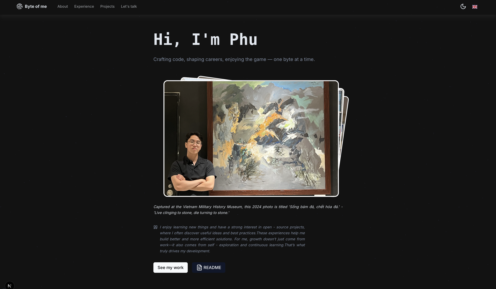
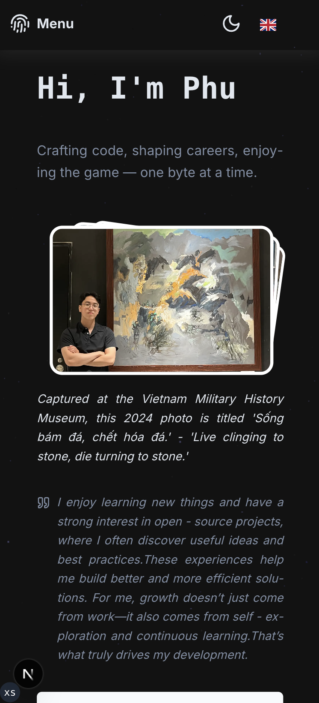

# 📸 Byte of Me

> A personal digital garden — built for storytelling, self-reflection, and showcasing growth as a developer, one byte at a time.

<div align="flex center">  
     
  
</div>

---

## Features

- Personal profile with bio, quote, and timeline
- Developer journey & reflections
- Multilingual support (EN, VI, FR) with `next-intl`
- Dark & Light theme with system preference

---

## Tech Stack

| Layer      | Stack                                                                   |
| ---------- | ----------------------------------------------------------------------- |
| Frontend   | [Next.js](https://nextjs.org/) (App Router)                             |
| Backend    | [Prisma](https://www.prisma.io/) ORM + PostgreSQL                       |
| Styling    | [Tailwind CSS](https://tailwindcss.com/) + Typography Plugin            |
| i18n       | [next-intl](https://github.com/amannn/next-intl) + dynamic translation. |
| Deployment | [Vercel](https://vercel.com/)                                           |

---

## Getting Started

```bash
# 1. Clone the repository
git clone https://github.com/lthphuw/byte-of-me.git
cd byte-of-me

# 2. Install dependencies
pnpm install

# 3. Setup environment
cp .env.example .env
# Fill in DATABASE_URL and other secrets

# 4. Run migrations & seed
pnpm prisma migrate dev --name init
pnpm db:seed

# 5. Start development server
pnpm dev
```

## Future work