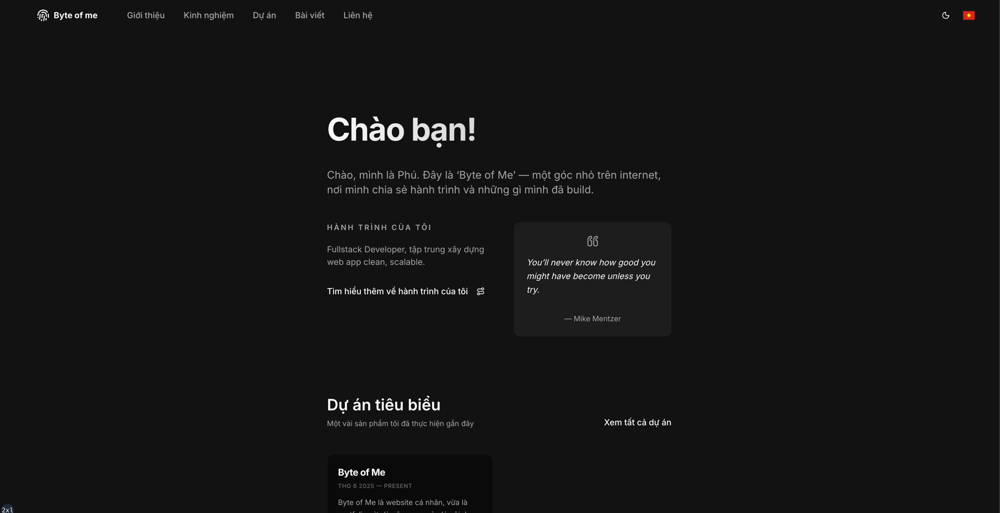
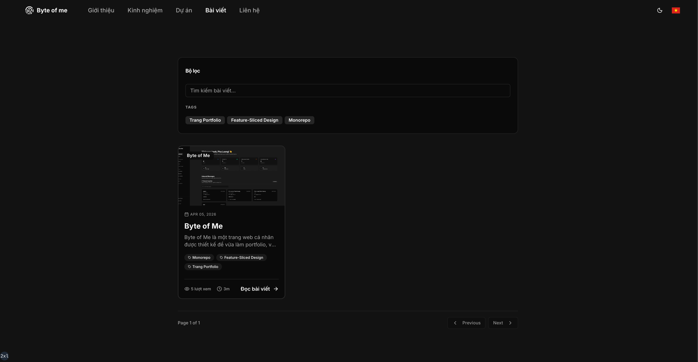
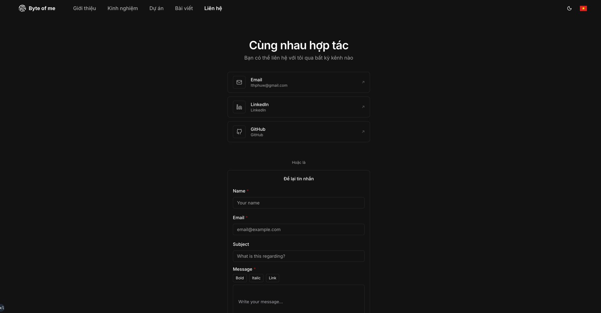
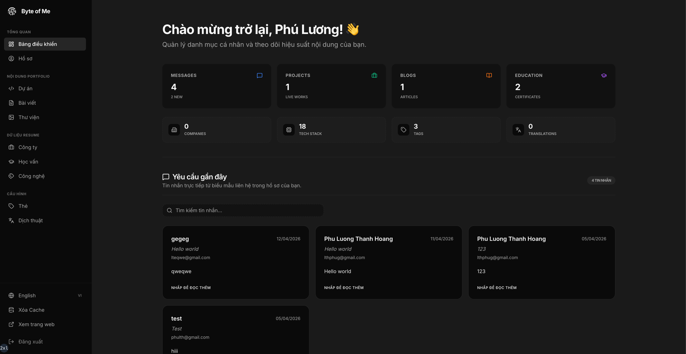
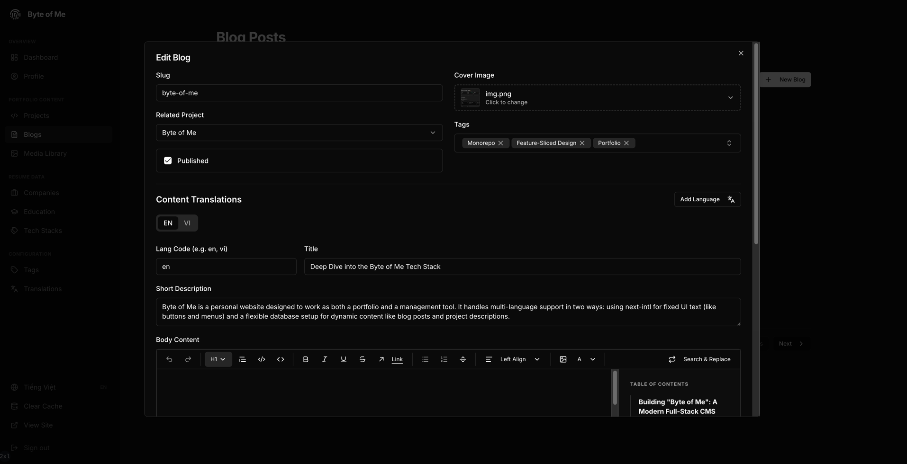
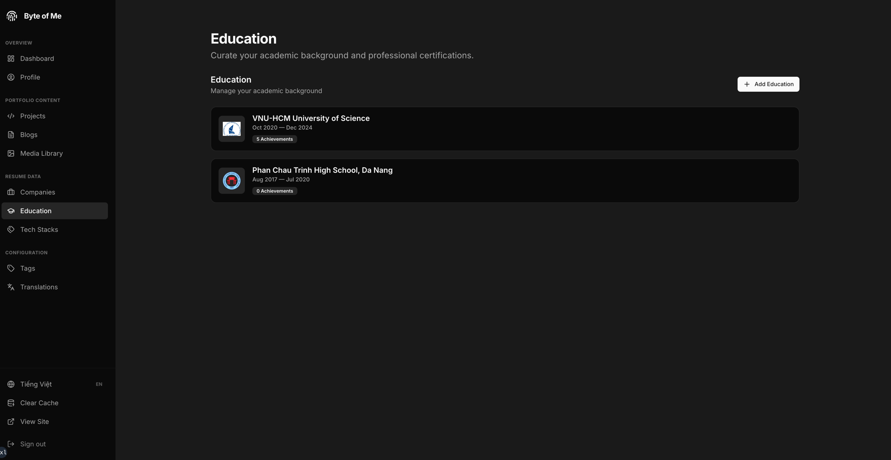

<div align="center">
  <h1>
    <a href="https://phu-lth.space/" target="_blank" style="text-decoration: none; color: inherit;">
      Byte of Me
    </a>
  </h1>

  <p><strong>A multilingual portfolio and personal CMS</strong></p>

  <p>Built with Next.js, Supabase, and Auth.js. This project features a clean public site for visitors and a private dashboard to manage content across different languages easily.</p>

  <div style="margin: 20px 0;">
    
    
    
    
    
    
    
  </div>

  <p>
    <a href="https://github.com/lthphuw/byte-of-me" target="_blank">
      
    </a>
    <a href="https://github.com/lthphuw/byte-of-me/fork" target="_blank" style="margin-left: 10px;">
      
    </a>
  </p>
</div>

---
## 📸 Demo

<details>
<summary>Click to view Public Portfolio</summary>
<br>

<div style="display: flex; gap: 10px; margin-bottom: 10px;">
  <div style="flex: 1;">
    <p align="center"><strong>Homepage</strong></p>
    
  </div>
  <div style="flex: 1;">
    <p align="center"><strong>Blogs</strong></p>
    
  </div>
</div>

<div align="center">
  <p><strong>Contact Page</strong></p>
  
</div>

</details>

<details>
<summary>Click to view Dashboard (CMS)</summary>
<br>

<div style="display: flex; gap: 10px; margin-bottom: 10px;">
  <div style="flex: 1;">
    <p align="center"><strong>Dashboard</strong></p>
    
  </div>
  <div style="flex: 1;">
    <p align="center"><strong>Blog Editor</strong></p>
    
  </div>
</div>

<div align="center">
  <p><strong>Education Manager</strong></p>
  
</div>

</details>
---
## Overview

Byte of Me is a personal website designed to work as both a portfolio and a management tool. It handles multi-language support in two ways: using `next-intl` for fixed UI text (like buttons and menus) and a flexible database setup for dynamic content like blog posts and project descriptions.

---

## Main Features

* **Flexible Data**: Uses **Prisma** and **Supabase** (PostgreSQL) to store and manage data reliably.
* **Easy Storage**: Handles images and files using **Supabase Storage** (S3-compatible).
* **Secure Login**: Private dashboard access is protected by **Auth.js**.
* **Smooth Performance**: Uses **TanStack Query** for fast data loading and background updates.
* **Modern Design**: Built with **shadcn/ui** and **Tailwind CSS**, including a dark mode that matches your system settings.
* **Multi-language**: Built-in support for switching between languages for all content.

---

## Project Structure

### Public Site
* **Home**: A quick intro and summary of what I do.
* **About**: Bio, education history, and a list of technologies I use.
* **Projects**: A gallery of my work with filters to find specific types of projects.
* **Blogs**: Technical articles with pagination and language switching.
* **Contact**: A simple way to get in touch.

### Dashboard (CMS)
* **Stats**: A quick look at how much content is on the site.
* **Media**: A place to upload and manage images or documents.
* **Content Management**: Dedicated sections to create, edit, or delete blogs, projects, tags, and work history (with multi-language content).
* **Translations**: A workspace to manage multi-language text for the entire site (for static content).

---

## How to Run Locally

### Prerequisites
* Node.js (v24.4.1)
* pnpm (`npm install -g pnpm`)

### Setup

1.  **Clone the project**:
    ```bash
    git clone [https://github.com/lthphuw/byte-of-me.git](https://github.com/lthphuw/byte-of-me.git)
    cd byte-of-me
    ```

2.  **Install dependencies**:
    ```bash
    pnpm install
    ```

3.  **Environment Variables**:
    Create your `.env` files based on the `.env.example` files found in:
  * `apps/web`
  * `packages/db`
  * `packages/storage`

4.  **Start developing**:
    ```bash
    pnpm dev
    ```
    Open `http://localhost:3000` in your browser.

---

## License

This project is licensed under the [MIT License](./LICENSE.md).
