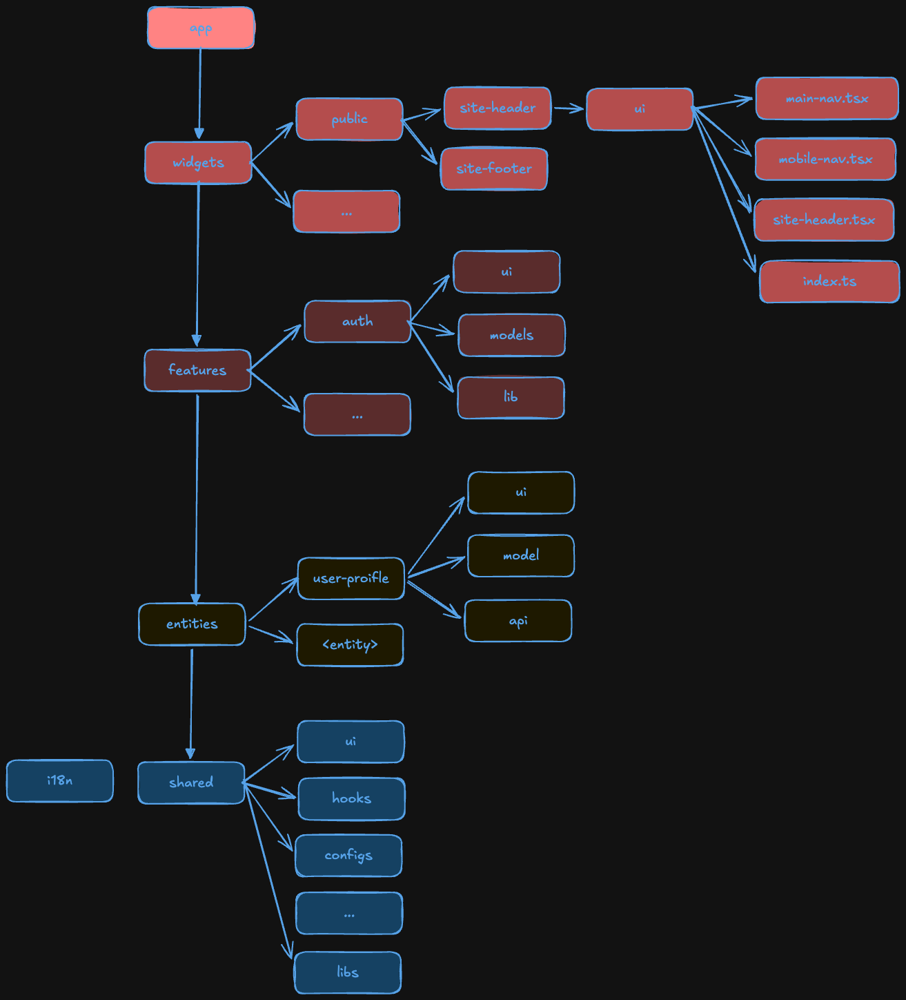

<div align="center">

# Byte of Me

**A multilingual portfolio & headless CMS — logged one byte at a time.**

A production personal website with a polished public portfolio and a private, multilingual content dashboard. Built as a TypeScript monorepo on Next.js 16 and the App Router.

[**🌐 Live — phu-lth.space**](https://phu-lth.space/)

<br />


<br />


<br />


</div>

---

## Overview

**Byte of Me** is a personal portfolio that doubles as its own content platform. Visitors get a fast, animated, fully bilingual (English / Tiếng Việt) site; the owner gets a private dashboard to write blog posts, manage projects and work history, and translate everything — without touching code or redeploying.

The whole thing is a single TypeScript monorepo, organized with [Feature-Sliced Design](https://feature-sliced.design/) on the frontend and shared workspace packages for the database, storage, and UI kit.

<div align="center">
  
</div>

---

## Highlights

### 🎨 Public portfolio
- **Home, About, Experience, Projects, Blogs, Contact** — server-rendered, SEO-friendly, and richly animated with Framer Motion.
- **Full-featured blog** — cover hero, author byline, breadcrumb, table of contents, reading-progress bar, related posts, prev/next navigation, and per-post **likes, claps, and threaded comments**.
- **Filterable, paginated** project and blog listings with shareable, URL-based filters.
- **A vertical experience timeline** rendered from live CMS data.

### 🔐 Private CMS dashboard
- Manage **blogs, projects, companies & roles, education, tags, tech stacks, media, and translations** from one place.
- **Rich-text editor** (TipTap) with code blocks, images, tables, and typography.
- **Media library** backed by Supabase Storage.
- Protected by **Auth.js** with GitHub & Google OAuth.

### 🌍 Two-layer internationalization
- **Static UI** strings (buttons, labels, nav, validation) via **next-intl** locale files.
- **Dynamic content** (blogs, projects, experience, tags…) translated and stored **in PostgreSQL**, editable from the dashboard.

### ⚡ Engineered for quality
- **Feature-Sliced Design** architecture with clear `app → widgets → features → entities → shared` boundaries.
- **Server Components first**, TanStack Query for client/server state, GPU-friendly lazy-loaded animations.
- **Turborepo + pnpm** workspace with shared, independently-typed packages.

<div align="center">
  <table>
    <tr>
      <td></td>
      <td></td>
    </tr>
  </table>
</div>

---

## The dashboard

<div align="center">
  <table>
    <tr>
      <td></td>
      <td></td>
      <td></td>
    </tr>
  </table>
</div>

---

## Tech stack

| Layer | Technology |
| --- | --- |
| **Framework** | Next.js 16 (App Router, RSC), React 19 |
| **Language** | TypeScript |
| **Styling** | Tailwind CSS, shadcn/ui, Framer Motion |
| **Data** | PostgreSQL (Supabase) via Prisma ORM |
| **Server state** | TanStack Query |
| **Auth** | Auth.js (NextAuth v5) — GitHub & Google OAuth |
| **i18n** | next-intl (UI) + database translations (content) |
| **Storage** | Supabase Storage |
| **Editor** | TipTap rich-text |
| **Forms & validation** | React Hook Form + Zod |
| **Tooling** | Turborepo, pnpm workspaces, ESLint, Prettier, Husky |

---

## Architecture

The frontend follows **Feature-Sliced Design** — each layer may only depend on the layers below it, keeping features isolated and reusable:

<div align="center">
  
</div>

```
byte-of-me/
├── apps/
│   └── web/                 # Next.js app (public site + dashboard)
│       └── src/
│           ├── app/         # App Router routes & layouts
│           ├── widgets/     # Composite UI blocks (page sections)
│           ├── features/    # User-facing capabilities
│           ├── entities/    # Domain models + their API/UI
│           └── shared/      # Config, i18n, libs, primitives
└── packages/
    ├── ui/                  # Shared component & design system (@byte-of-me/ui)
    ├── db/                  # Prisma schema & client (@byte-of-me/db)
    ├── storage/             # Supabase Storage helpers (@byte-of-me/storage)
    ├── logger/              # Structured logging (@byte-of-me/logger)
    └── config/              # Shared TS/tooling config (@byte-of-me/config)
```

---

## Getting started

> Requires **Node.js ≥ 20**, **pnpm 10**, and a PostgreSQL database (Supabase works out of the box).

```bash
# 1. Install dependencies
pnpm install

# 2. Configure environment
cp apps/web/.env.example apps/web/.env
#   → set DATABASE_URL, AUTH_* secrets, Supabase storage keys, etc.

# 3. Generate the Prisma client
pnpm --filter @byte-of-me/db generate

# 4. Run the dev server
pnpm dev            # http://localhost:3000
```

Useful scripts (run from the repo root):

| Command | Description |
| --- | --- |
| `pnpm dev` | Start the app in development |
| `pnpm build` | Production build (all packages) |
| `pnpm check` | Type-check → lint → build (full verification) |
| `pnpm check-types` | Type-check every package |
| `pnpm lint` | Lint every package |

Git hooks (Husky) run type-check + lint on **commit** and a full build on **push**.

---

## Author

**Phu Luong Thanh Hoang** ([@lthphuw](https://github.com/lthphuw))
🌐 [phu-lth.space](https://phu-lth.space/) · ✉️ lthphuw@gmail.com

## License

Released under the terms in [LICENSE.md](LICENSE.md).
