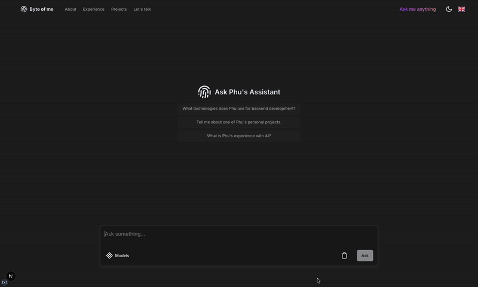

<div align="center">
  <h1>
    <a href="https://phu-lth.space/" target="_blank" style="text-decoration: none; color: inherit;">
      Byte of Me
    </a>
  </h1>
  <p>A full-stack portfolio with a free-tier AI assistant powered by a RAG pipeline. Explore my projects and skills through natural language queries, with support for i18n, dark/light mode, and responsive design.</p>
  
  <div style="margin: 20px 0;">
   <a href="https://nextjs.org/" target="_blank">
      
    </a>
    <a href="https://github.com/DavidHDev/react-bits" target="_blank">
      
    </a>
    <a href="https://www.radix-ui.com/" target="_blank">
      
    </a>
    <a href="https://www.framer.com/motion/" target="_blank">
      
    </a>
    <a href="https://tailwindcss.com/docs" target="_blank">
      
    </a>
    <a href="https://www.prisma.io/docs" target="_blank">
      
    </a>
    <a href="https://supabase.com/docs" target="_blank">
      
    </a>
    <a href="https://www.pinecone.io/docs/" target="_blank">
      
    </a>
    <a href="https://langchain-ai.github.io/langgraph/" target="_blank">
      
    </a>
    <a href="https://ai.google.dev/gemini-api/docs" target="_blank">
      
    </a>
    <a href="https://vercel.com/docs" target="_blank">
      
    </a>
    <a href="https://www.cloudflare.com/products/turnstile/" target="_blank">
      
    </a>
    <a href="https://upstash.com" target="_blank">
      
    </a>
  </div>

  <p >
    <a href="https://github.com/lthphuw/byte-of-me" target="_blank">
      
    </a>
    <a href="https://github.com/lthphuw/byte-of-me/fork" target="_blank" style="margin: 0px 20px;">
      
    </a>
  </p>
</div>

## About the Project

Byte of Me is a full-stack portfolio showcasing my projects, skills, and experiences. It features an AI assistant powered by a Retrieval-Augmented Generation (RAG) pipeline using [**LangChain**](https://langchain-ai.github.io/langgraph/), [**Google Gemini 2.0 Flash**](https://cloud.google.com/vertex-ai/generative-ai/docs/models/gemini/2-0-flash) as the LLM, [**text-embedding-004**](https://ai.google.dev/gemini-api/docs/models#text-embedding) for embeddings, and [**Pinecone**](https://www.pinecone.io/) as the vector database. Conversation threads and user history are managed via [**PostgresSaver**](https://github.com/langchain-ai/langgraphjs/tree/main/libs/checkpoint-postgres) in Supabase PostgreSQL, enabling context-aware responses in English. The portfolio includes a multilingual UI with i18n, dark/light mode, and responsive design for mobile and desktop.

## Key Features

- **Stateful AI Assistant**: Query my portfolio in natural language (English only), powered by [**LangChain**](https://langchain-ai.github.io/langgraph/), [**Google Gemini 2.0 Flash**](https://ai.google.dev/gemini-api/docs), [**text-embedding-004**](https://ai.google.dev/gemini-api/docs), and [**Pinecone**](https://www.pinecone.io/), with conversation state managed by [**PostgresSaver**](https://github.com/langchain-ai/langgraphjs/tree/main/libs/checkpoint-postgres).
- **Internationalization**: Multilingual UI via i18n for global accessibility.
- **Responsive Design**: Optimized for mobile and desktop with [**Tailwind CSS**](https://tailwindcss.com/docs), [**Framer Motion**](https://www.framer.com/motion/), [**React Bits**](https://github.com/DavidHDev/react-bits), and [**Radix UI**](https://www.radix-ui.com/).
- **Dark/Light Mode**: Toggle between themes for a personalized experience.
- **Full-Stack Architecture**: Built with [**Next.js**](https://nextjs.org/), [**Prisma ORM**](https://www.prisma.io/docs), and [**Supabase (PostgreSQL)**](https://supabase.com/docs).
- **Rate Limiting**: Configurable limits for chat requests using [**Upstash**](https://upstash.com).
- **Bot Protection**: Secured with [**Cloudflare Turnstile**](https://www.cloudflare.com/products/turnstile/) CAPTCHA.
- **Deployment**: Hosted on [**Vercel**](https://vercel.com/docs)’s free tier for fast performance.

## Demo

  
_Try asking: "What projects has Phu built?" or "What is Phu’s tech stack?"_

## Setup Instructions

1. **Clone the Repository**:

   ```bash
   git clone https://github.com/lthphuw/byte-of-me.git
   cd byte-of-me
   ```

2. **Install Dependencies**:

   ```bash
   pnpm install
   ```

3. **Set Up Environment Variables**:

   - Create `.env.local` or `.env` files in `apps/web`, `packages/ai`, and `packages/db` as described in their respective READMEs:
     - [Web Frontend (apps/web)](apps/web/README.md)
     - [AI Assistant (packages/ai)](packages/ai/README.md)
     - [Database (packages/db)](packages/db/README.md)

4. **Run the Development Server**:

   - From the root directory:
     ```bash
     pnpm dev
     ```
   - Open `http://localhost:3000` in your browser.

5. **Deploy to Vercel** (optional):
   - Push your code to GitHub.
   - Connect your repository to Vercel via the Vercel dashboard.
   - Add module-specific environment variables to Vercel’s _Settings > Environment Variables_ (see submodule READMEs).
   - Deploy the project.

## Tech Stack

| Technology                                                                                                       | Purpose                                                 |
| ---------------------------------------------------------------------------------------------------------------- | ------------------------------------------------------- |
| [**Next.js**](https://nextjs.org/)                                                                               | Server-side rendering and static site generation        |
| [**React Bits**](https://github.com/DavidHDev/react-bits)                                                        | Beautiful open-source React components for the frontend |
| [**Radix UI**](https://www.radix-ui.com/)                                                                        | Accessible UI primitives for the frontend               |
| [**Framer Motion**](https://www.framer.com/motion/)                                                              | Smooth animations and transitions                       |
| [**Tailwind CSS**](https://tailwindcss.com/docs)                                                                 | Utility-first CSS for responsive UI                     |
| [**Prisma**](https://www.prisma.io/docs)                                                                         | ORM for Supabase PostgreSQL database                    |
| [**Supabase**](https://supabase.com/docs)                                                                        | Backend-as-a-service for auth and storage               |
| [**Pinecone**](https://www.pinecone.io/)                                                                         | Free-tier vector database for RAG                       |
| [**LangChain**](https://langchain-ai.github.io/langgraph/)                                                       | Framework for RAG pipeline and state management         |
| [**LangChain.js PostgresSaver**](https://github.com/langchain-ai/langgraphjs/tree/main/libs/checkpoint-postgres) | Persists conversation state in PostgreSQL               |
| [**Google Gemini**](https://ai.google.dev/gemini-api/docs)                                                       | AI model (Gemini 2.0 Flash, text-embedding-004)         |
| [**Vercel**](https://vercel.com/docs)                                                                            | Deployment and hosting platform                         |
| [**Cloudflare Turnstile**](https://www.cloudflare.com/products/turnstile/)                                       | CAPTCHA for bot protection                              |
| [**Upstash**](https://upstash.com)                                                                               | Redis-based rate limiting and caching                   |

## Contributing

Contributions are welcome! Please open an issue or submit a pull request to suggest improvements or report bugs.

## License

This project is licensed under the MIT License. See [LICENSE](LICENSE) for details.

---
