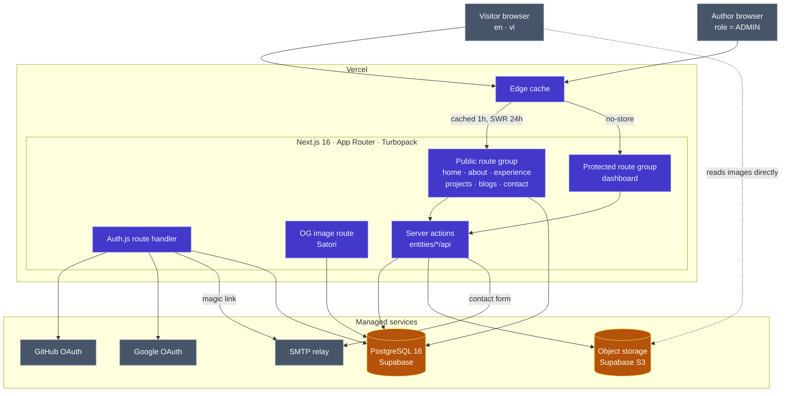
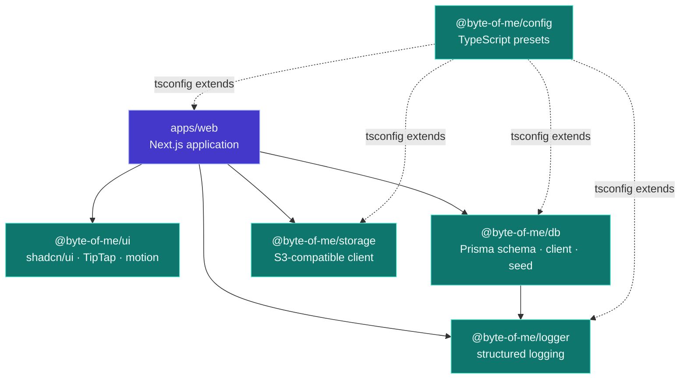
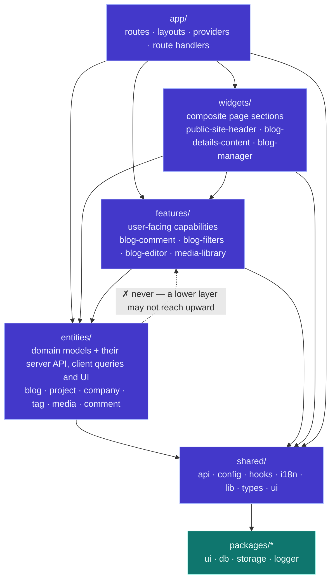
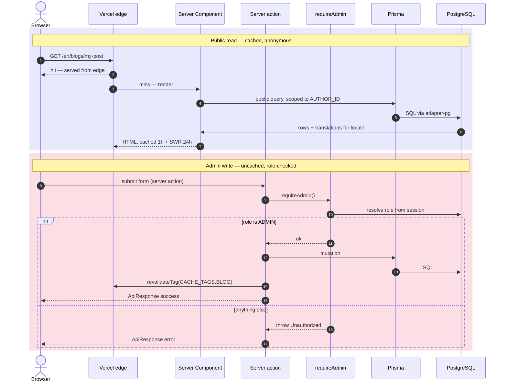
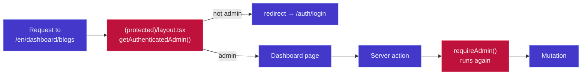
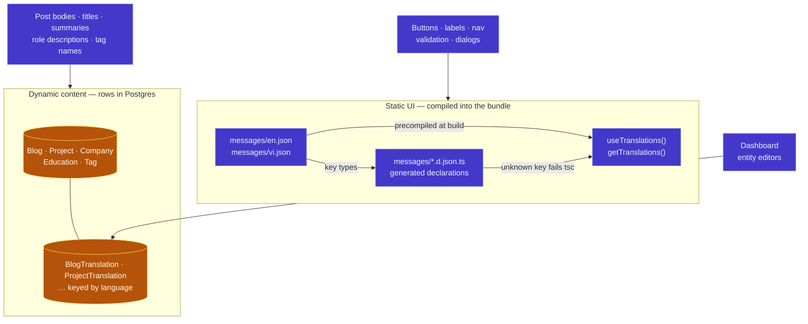
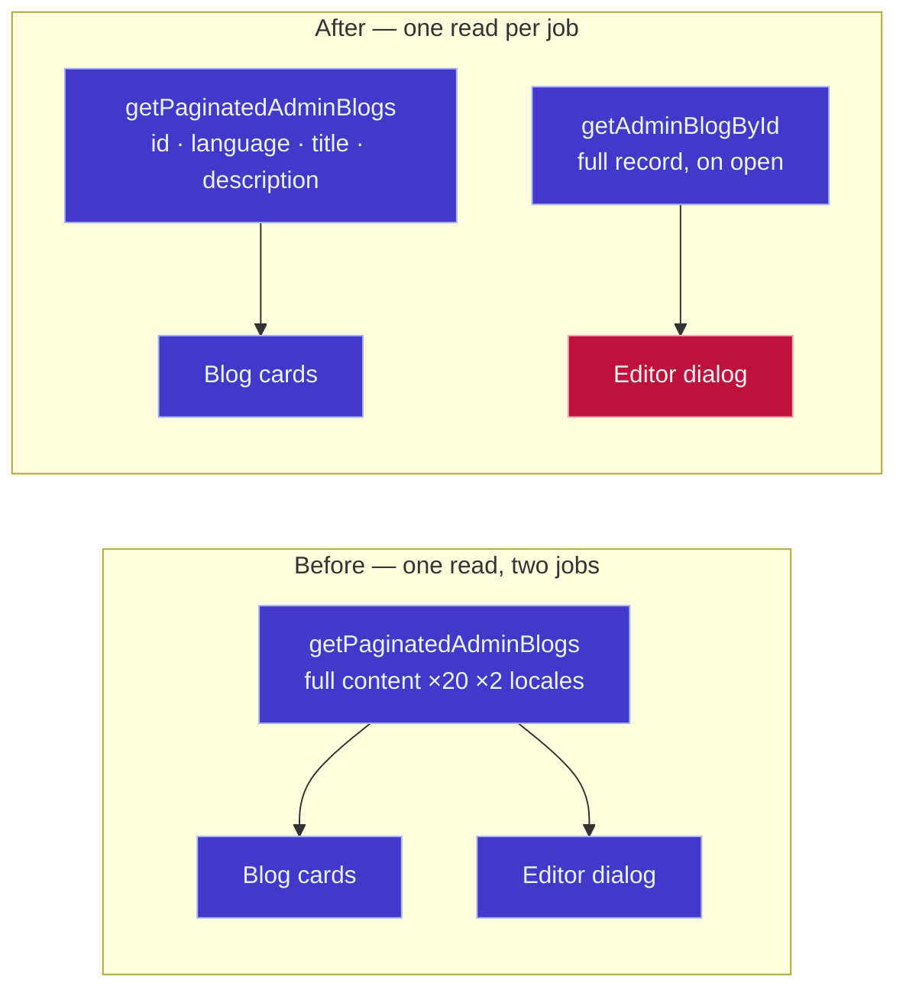

# Architecture

How **Byte of Me** fits together, from the outside in. Five diagrams, each answering one question:

1. [System context](#1-system-context) — what runs where, and what we don't own
2. [Monorepo & package graph](#2-monorepo--package-graph) — which workspace depends on which
3. [Feature-Sliced Design](#3-feature-sliced-design-layers) — how `apps/web` is layered
4. [Request & trust flow](#4-request--trust-flow) — how a read differs from an admin write
5. [Two-layer i18n](#5-two-layer-internationalization) — where each kind of string lives

Then: [caching & invalidation](#caching--invalidation) and [where to change what](#where-to-change-what).

---

## Legend

Colour encodes **ownership**, not category — it answers "if this breaks, whose problem is it?"

| | Meaning |
| --- | --- |
| 🟦 **Indigo** | Application code we ship in the Next.js runtime |
| 🟩 **Teal** | Workspace packages (`packages/*`), consumed as TypeScript source |
| 🟧 **Amber** | Persistent state — Postgres tables, the storage bucket |
| 🟥 **Rose** | Trust boundary: something checks a role here |
| ⬛ **Slate** | Outside our deploy — browsers, managed services, OAuth providers |

Dashed borders mark a boundary we don't deploy across.

---

## 1. System context

**Notes**

- There is no `middleware.ts`. `/` redirects to `/en`; the locale is a route segment; unmatched paths fall through to a catch-all that calls `notFound()`.
- Cache policy is set per route group in `next.config.js` `headers()` — public gets `s-maxage=3600, stale-while-revalidate=86400`, anything under `dashboard` gets `no-store`.
- Uploads go **through** the server action (multipart → `PutObject`), so storage credentials never reach the browser. Reads bypass the app entirely: `next/image` is allowed to fetch from the Supabase host listed in `remotePatterns`.
- Prisma 7 talks to Postgres through `@prisma/adapter-pg` — a driver adapter, not a query-engine binary. That is why nothing here ships a native engine.

---

## 2. Monorepo & package graph

Solid arrows are runtime dependencies; dashed arrows are build-time only — `@byte-of-me/config` ships no code, only `tsconfig` presets that each workspace extends by relative path.

Every package is consumed as **TypeScript source** via `transpilePackages`, so there is no build step before `bun run dev`. Turborepo still runs `build` for the packages that emit declarations (`db`, `storage`, `logger`) because `check-types` and `test` depend on `^build`.

`@byte-of-me/ui` uses **subpath exports** rather than one barrel — `./rich-text-editor`, `./rich-text`, `./lib/sanitize`. That is deliberate: importing the barrel from a public-site client component would drag all of TipTap into the visitor's bundle.

---

## 3. Feature-Sliced Design layers

`apps/web/src` is layered. A layer may import from the layers **below** it, never above and never sideways across slices.

The dashed edge is the rule worth stating out loud: an `entity` never imports a `feature`. If an entity seems to need one, the logic belongs in the entity, or the feature needs to pass it in.

Each slice exposes an `index.ts` barrel; cross-slice imports go through it rather than reaching into a file path.

Within `widgets/` and `features/`, slices are grouped by audience — `auth`, `dashboard`, `public` — which keeps the "never expose dashboard functionality to a public route" rule visible in the directory listing rather than buried in a guard.

---

## 4. Request & trust flow

Two paths through the same codebase. The difference is not the route — it's who checks the role.

**Two independent guards, on purpose:**

The layout guard protects the *view*. It does not protect the *action* — server actions are addressable endpoints, callable without ever rendering the page. So every admin action and admin query calls `requireAdmin()` itself. The route guard is convenience; the action guard is the security boundary.

Auth.js issues JWT sessions. The role is read from the database on sign-in and carried on the token; providers are email magic link, GitHub, and Google.

---

## 5. Two-layer internationalization

Two translation systems that must never be mixed.

The dividing line: **if a translator would need the running app to know what the string means, it's UI text** (next-intl). If it's something the author writes as content, it's a database translation. Never move content into locale JSON; never store UI strings in the database.

A third path used to exist — a `Translation` table whose rows were merged into the next-intl catalogue at request time — and it has been removed. It never worked (dot-path keys were never nested, and the query was unfiltered by locale), and it blurred the very line this section draws.

The client catalogue is scoped per route group rather than mounted once at the locale root: each group layout mounts `NextIntlClientProvider` with only the namespaces its **client** components read (see `src/shared/i18n/messages.ts`). Server components use `getTranslations` and never constrain those lists. Reads of `*Translation` rows are filtered to `[locale, 'en']` — see `getTranslationLanguages`.

Locales are `en` (default) and `vi`, declared once in `src/shared/i18n/routing.ts`.

---

## Caching & invalidation

Three layers, each invalidated differently:

| Layer | Scope | Invalidated by |
| --- | --- | --- |
| Vercel edge (`headers()`) | Public HTML, 1h + 24h SWR | Time, or a deploy |
| Next.js data cache | Tagged queries | `revalidateTag(CACHE_TAGS.X)` inside the mutating server action |
| TanStack Query | Client-side server state in the dashboard | Query invalidation after a mutation resolves |

`CACHE_TAGS` (`src/shared/lib/constants.ts`) is the single list of tags — `blog`, `project`, `company`, `education`, `media`, `tag`, `tech-stack`, `social-link`, `user-profile`, `comment`, `contact-message`. A mutation that forgets its tag is the usual cause of "I saved it but the public page is stale."

`purgeEntireCache()` in `src/shared/lib/revalidate.ts` is the blunt escape hatch — `revalidatePath('/', 'layout')`.

Blog view counts deliberately sit outside all of this: `trackBlogView` writes a `BlogStatisticLog` row guarded by a per-post cookie, and live stats are read uncached.

---

## Where to change what

| I want to… | Start here |
| --- | --- |
| Add a page | `apps/web/src/app/[locale]/(public)/` + a widget in `widgets/public/` |
| Add a dashboard section | `app/[locale]/(protected)/dashboard/` + `widgets/dashboard/` + `features/dashboard/` |
| Change what a domain model can do | `entities/<model>/api/` — one file per operation, each starting with a guard |
| Add a UI string | `apps/web/messages/en.json` **and** `vi.json` (types regenerate on build; `i18n-parity.spec.ts` fails if you touch only one) |
| Add a dashboard editor | A **separate by-id read** for the form — never reuse the list row. See below |
| Add a translatable content field | `packages/db/prisma/schema.prisma` → the `*Translation` model → migration |
| Add a shared component | `packages/ui/src/` + an entry in `exports` if it should be deep-imported |
| Change cache behaviour | `next.config.js` `headers()` for edge, `CACHE_TAGS` for data |
| Change who can do something | `src/shared/lib/auth/session.ts` |

---

## List reads and edit reads are separate

A dashboard manager renders a list; clicking Edit opens a dialog. The tempting shortcut is
to hand the list row straight to the dialog as `initialData` — and blogs did exactly that,
which forced the list query to carry every post's full TipTap body (20 posts × 2 locales)
so the editor would have something to open.

That coupling is worse than the wasted bytes: narrowing the list query then empties the
editor, and the next Save writes that emptiness over a published post.

The dialog is a trust boundary of its own: it must not mount the form until the full record
has arrived. The guard is `Boolean(editing) && !fullRecord` — one condition covering
loading, fetch failure **and** idle, because any of the three leaves the form holding a
partial row.

`project`, `tag`, `company` and `user-profile` still reuse their list rows. Their
translatable fields are short, so today it is only wasted bytes — but the failure mode is
identical the moment one of them grows.

---

*Diagrams render natively on GitHub. Edit this file rather than exporting images — the source of truth should diff.*
